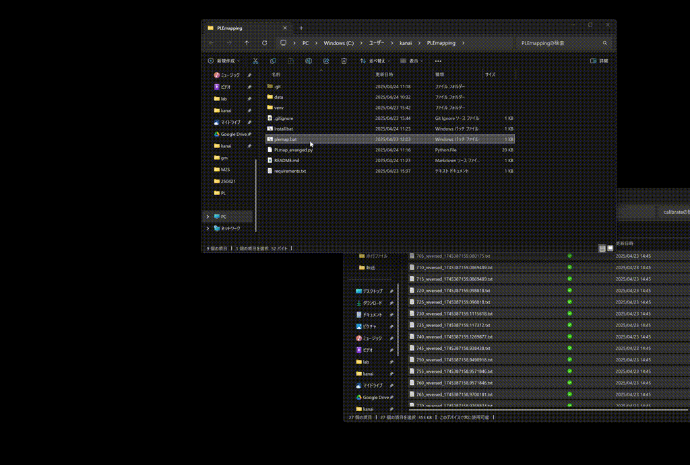

# PLEマップ作成ソフト
キャリブレーション済みのPLスペクトルからPLEマップを作成するソフトウェアです。
gif


# インストール方法
以下コマンドを実行
```bash
git clone https://github.com/chiashi-lab/PLEmapping.git
cd PLEmapping
python -m venv venv
CALL venv/Scripts/activate
pip install -r requirements.txt
```
# 使い方
0. plemap.batをダブルクリックします。
1. キャリブレーション済みのPLスペクトルをソフトウェア上にドラッグ＆ドロップします。

# 注意点
励起波長はファイル名の先頭にアンダースコア区切りで記載してください。